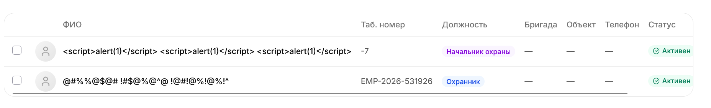

# FUNC-001: [Validation] Unvalidation_fields_on_worcker_form

## Общая информация:
ID: 001
Type: functional/validation
Secerity: Majopr
Priority:
Date: 05.10.2026
Version: 1.0

## Окружение
win11, firefox, 2560x1600

## Предусловия
1. Продйенная авторизация
2. открытая страница 'добавить сотрудника'

## Шаги воспроизведения
1. Поле «Имя»: ввести 
2. Поле «Фамилия»: ввести ' OR 1=1 --
3. Поле «Табельный номер»: ввести -1
4. Поле «Дата приёма»: ввести 01.01.2099
5. Нажать «Отправить»

## Ожидаемый результат:
- Каждое поле подсвечивается с конкретной ошибкой:
  - Имя/Фамилия: «Недопустимые символы»
  - Табельный номер: «Только положительные числа»
  - Дата: «Дата не может быть в будущем»
  - Номер телефона: "должен состоять из цифр"
- Кнопка «Отправить» неактивна до исправления

## Фактический результат:
Фактически:
- Форма отправляется без проверок
- Данные уходят на сервер (см. Network: POST /api/workers, status 500)
- Пользователь видит React Error #441

## Вложения:

POST
https://www.workdo.ru/security/employees/5b6b4e54-e511-42bc-929c-6a367cead77c/edit
[HTTP/3 500  683ms]