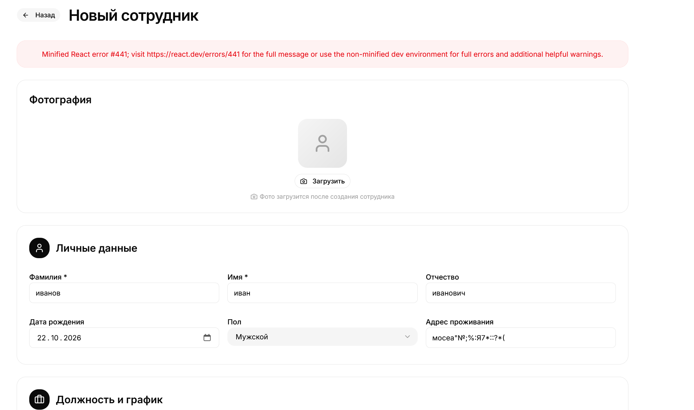

# FUNC-YYY: [Frontend] React Error #441 при ошибке сервера вместо понятного сообщения

## Общая информация:
ID: 002
Type: functional/validation
Secerity: Major
Priority: High
Date: 05.10.2026
Version: 1.0

## Окружение
win11, firefox, 2560x1600

## Предусловия
1. Продйенная авторизация
2. открытая страница добавления сотрудника

## Шаги воспроизведения
1. Открыть форму добавления сотрудника
2. Отправить данные, которые сервер не может обработать
   (например, табельный номер = ' OR 1=1 --)
3. Наблюдать результат

## Ожидаемый результат:
- Пользователь видит понятное сообщение («Не удалось сохранить»)
- Форма остаётся доступной, данные не теряются
- Ошибка логируется в Sentry/консоль

## Фактический результат:
- Приложение падает с Minified React error #441

## Вложения:

Примечание:
Отсутствие error boundary — системная проблема.
Проверить, воспроизводится ли #441 в других разделах при ошибках API.